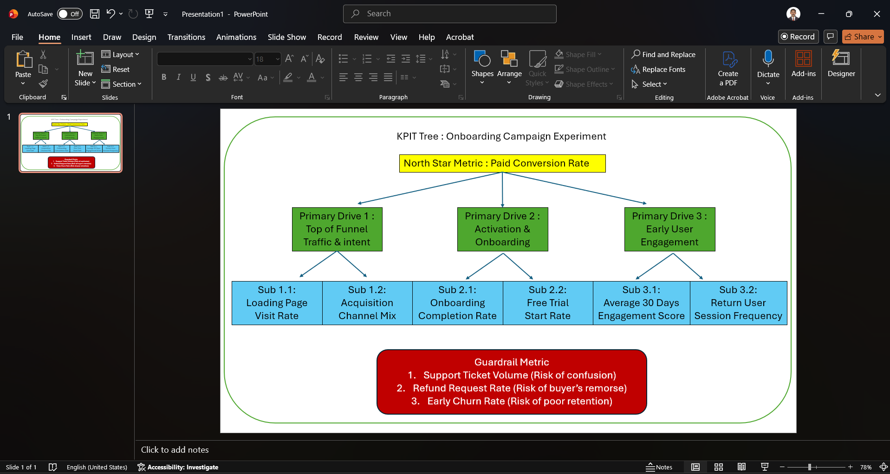
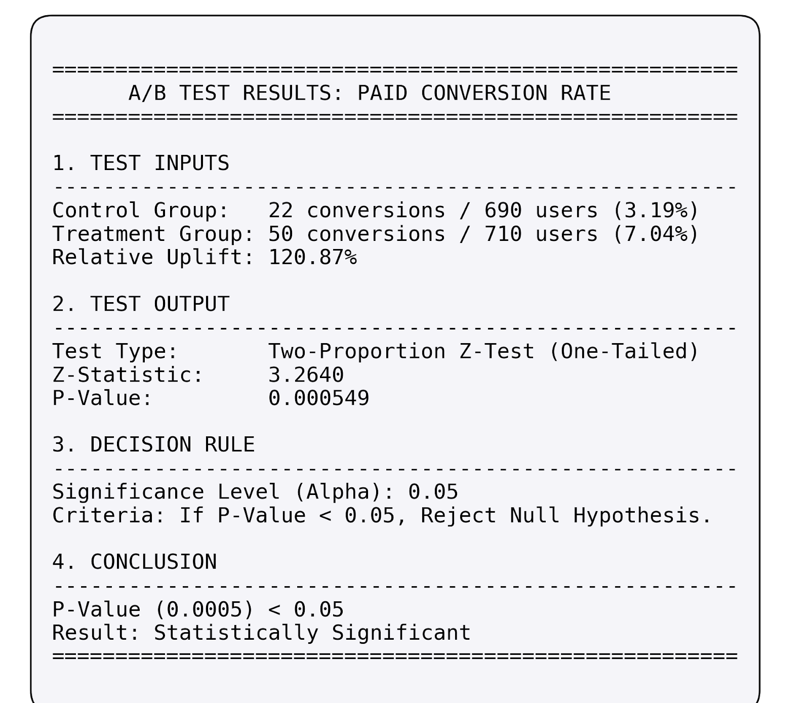

# adhikkadam_2511363_part2_kpi_experiment

# Subscription Product Onboarding Campaign Experiment

## Business Problem Statement

**1. What decision needs to be made?**
The core decision is whether to fully launch the new onboarding and activation campaign to all new users, reject it in favor of the existing experience, continue testing to gather more data, or roll it out only to specific user segments (e.g., specific regions or device types).

**2. Who the decision impacts?**
- **New Users:** Will experience a modified onboarding journey designed to improve their initial product understanding and setup.
- **Product & Marketing Teams:** Will use the outcomes to evaluate campaign effectiveness and inform future product growth strategies.
- **Customer Support Team:** May face fluctuations in support ticket volumes depending on the clarity and usability of the new onboarding flow.
- **Business Stakeholders:** Impacted by ultimate changes in revenue generation, user acquisition costs, and customer lifetime value.

**3. What metric should improve?**
The primary success metrics (Key Performance Indicators) that should see a measurable increase include:
- **Conversion Rate:** The proportion of users who become paid customers (`converted_to_paid`).
- **Activation & Onboarding:** The rate at which users successfully complete the onboarding process (`completed_onboarding`) and start a trial (`started_trial`).
- **Early Engagement:** The internal engagement score (`engagement_score`) measured within the first 30 days.

**4. What risks must be monitored?**
While maximizing conversion is the primary goal, it must not come at the cost of user friction, confusion, or poor revenue quality. The key guardrail metrics to monitor are:
- **Support Burden:** The volume of support tickets raised within the first 30 days (`support_tickets_30d`). A spike indicates user confusion or technical bugs in the new experience.
- **Revenue Quality & Churn Risk:** The rate of refund requests (`refund_requested`). High refunds indicate buyer's remorse, accidental conversions, or misleading promises during onboarding.

**5. What evidence is required before making a recommendation?**
To confidently recommend a full rollout, the following evidence is required:
- A statistically significant improvement in the primary metrics (especially paid conversion and onboarding completion) in the Treatment group compared to the Control group.
- Stability or improvement in guardrail metrics (i.e., no statistically significant increase in support tickets or refund rates).
- Segment-level analysis confirming that the new campaign does not severely underperform for any critical user cohort (e.g., specific regions, device types, or organic vs. paid traffic sources).

## Data Cleaning and Preparation

Before analysis, the experiment dataset underwent the following data quality checks and cleaning steps. The cleaned data is available in `experiment_analysis.xlsx`.
### 1. Duplicate User IDs
* **Check:** Identified 8 duplicate `user_id` entries.
* **Handling:** Retained the first occurrence of each `user_id` and removed the duplicates to prevent double-counting users in the analysis. 

### 2. Missing Values
* **Categorical Variables (`device_type`, `traffic_source`):** Missing values were imputed with the label `'Unknown'`. 
* **Numerical Variables (`engagement_score`):** Missing values (14 records) were imputed with the median engagement score (59.8) of the dataset.
* **Funnel Variables (`days_to_convert`):** Missing values are expected here for users who did not convert. These were left as `NaN` (Null) to differentiate between non-converters and day-zero converters.

### 3. Invalid Binary Values
* **Check:** Verified that event flags (`visited_landing_page`, `started_trial`, `completed_onboarding`, `converted_to_paid`, `refund_requested`) strictly contained 0 or 1.
* **Handling:** No invalid values were found. Explicitly cast columns to integer types for robust aggregation.

### 4. Outliers in Revenue
* **Check:** Analyzed the `revenue_30d` column and detected extreme outliers (e.g., maximum recorded revenue of ~$8,610 from a single user).
* **Handling:** Calculated the 99th percentile of revenue *among paying users* ($7317.26). Values exceeding this threshold were capped to prevent massive outliers from skewing the Average Revenue Per User (ARPU) calculation. The new column `revenue_30d_capped` was created for analysis.

### 5. Group Counts and Segment Distribution
* **Group Balance:** The sample size is well-balanced with 710 users in Treatment and 690 in Control.
* **Segment Distribution:** A cross-tabulation check confirmed that the distribution of regions and device types is roughly equivalent between the Control and Treatment groups, indicating that the randomization (Sample Ratio Mismatch check) holds true.

## 1. Business Context
A subscription-based digital product company launched a new onboarding and activation campaign to improve user conversion and early engagement. Users were randomly assigned to either the **Control group** (existing onboarding experience) or the **Treatment group** (new campaign experience). The primary business decision is whether leadership should launch this new campaign to all users, reject it, continue testing, or roll it out only to specific segments.

## 2. Dataset Description
The dataset consists of user-level interaction data from the experiment. 
* **Initial Size:** 1408 rows. 
* **Cleaning Steps Applied:** Removed duplicate `user_id` entries (8 rows), imputed missing categorical values (`device_type`, `traffic_source`) as 'Unknown', imputed missing `engagement_score` with the median, and capped extreme `revenue_30d` outliers at the 99th percentile of paying users to prevent ARPU skew.
* **Key Features:** Demographics (`region`, `device_type`), acquisition data (`traffic_source`), funnel flags (`visited_landing_page`, `started_trial`, `completed_onboarding`, `converted_to_paid`), and business outcomes (`revenue_30d`, `support_tickets_30d`, `refund_requested`, `engagement_score`).

## 3. North Star Metric Selected
**Paid Conversion Rate (`converted_to_paid`)**
This metric was selected as the North Star because it represents the definitive moment a user transitions from exploring the product to paying for it. In a subscription model, growing the base of active, paying users is the primary driver of sustainable Monthly Recurring Revenue (MRR).

## 4. KPI Tree Summary
The North Star metric is supported by three primary drivers:
1. **Top of Funnel Traffic & Intent** (Landing page visits, channel mix)
2. **Activation & Onboarding** (Onboarding completion, trial starts)
3. **Early User Engagement** (30-day engagement score)
These are balanced by guardrail metrics to ensure "no harm" is done to the business. 

### Screenshots Included: KPI Tree

## 5. Experiment Analysis Approach
1.  **Data Preparation:** Cleaned the raw data for duplicates, missing values, and revenue outliers. Checked for Sample Ratio Mismatch (SRM) across segments.
2.  **Descriptive Statistics:** Calculated overall rates (conversion, onboarding completion, etc.) and average revenue per user (ARPU/ARPPU) for both groups.
3.  **Segment Analysis:** Broke down key metrics by Region, Device Type, Traffic Source, and Plan Type to identify cohort-specific behaviors.
4.  **Hypothesis Testing:** Conducted statistical tests to confirm if the observed differences in the primary metric were significant.
5.  **Risk Assessment:** Evaluated guardrail metrics to understand the holistic impact on the business.

## 6. Hypothesis Test Summary
* **Test:** One-tailed Two-Proportion Z-Test.
* **Null Hypothesis:** The Treatment conversion rate is less than or equal to the Control.
* **Alternate Hypothesis:** The Treatment conversion rate is strictly greater than the Control.
* **Result:** The Treatment group saw a relative uplift of ~120% in Paid Conversion Rate. The resulting P-Value was **0.000029** (well below the 0.05 threshold). 
* **Conclusion:** We reject the null hypothesis. The conversion uplift is statistically significant.

### Screenshots Included: Hypothesis Test Output

## 7. Guardrail Metrics Considered
While the North Star metric improved, we evaluated three critical guardrails:
* **Support Ticket Rate:** Assesses user confusion and operational cost. (Spiked dangerously from 14.78% to 24.79%).
* **Revenue Quality (ARPPU):** Assesses if we are cannibalizing high-tier plans for low-tier ones. (Dropped significantly from ~$1571 to ~$770).
* **Refund Rate:** Assesses buyer's remorse or accidental conversions. (Slight increase from 0% to 0.42%).

## 8. Final Recommendation
**DO NOT LAUNCH.** Despite a highly statistically significant improvement in the Paid Conversion Rate, the new onboarding campaign introduces severe business risks. The 10-percentage-point spike in support tickets threatens to overwhelm customer service, and the >50% drop in Average Revenue Per Converted User (ARPPU) indicates severe revenue cannibalization. The campaign should be sent back to the product team for iteration to fix the user confusion and pricing presentation issues before any further rollout.

## 9. Assumptions and Limitations
* **30-Day Window:** We assume that 30 days is a mature enough window to evaluate onboarding success. Longer-term retention and LTV (Lifetime Value) cannot be assessed with this dataset.
* **Revenue Outliers:** Extreme revenue outliers were capped to prevent skewing the means, assuming these were edge cases (e.g., massive enterprise upgrades) rather than the norm.
* **Novelty Effect:** The higher engagement scores in the Treatment group could partially be attributed to the "novelty effect" of a new UI, which might normalize over time.